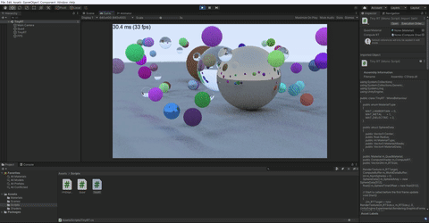
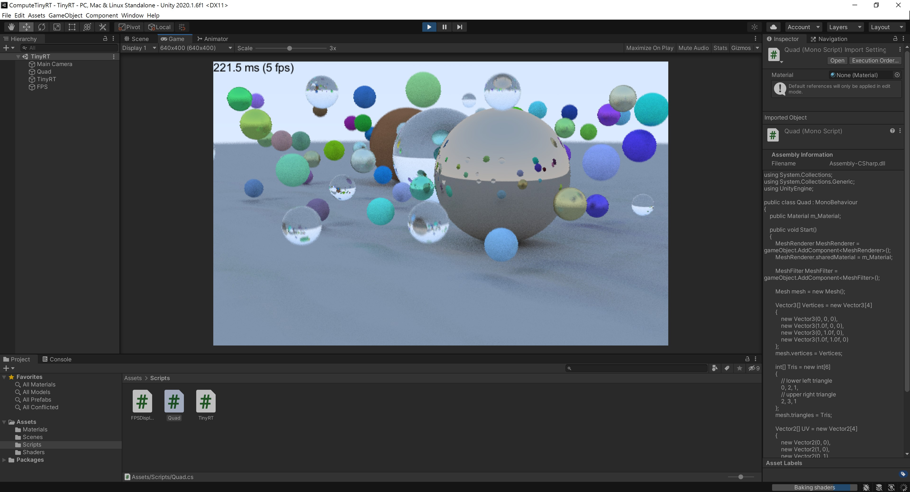

# Compute Tiny Ray Tracer

---

This is an Unity sample project which shows how to implement a tiny ray tracer using compue shader. The implementation is based on [Ray Tracing in One Weekend](https://raytracing.github.io/books/RayTracingInOneWeekend.html) article.

## Image Quality Compare

Samples per pixel  : 64

Maximum tracing depth : 64

Samples per pixel  : 16

Maximum tracing depth : 6

 