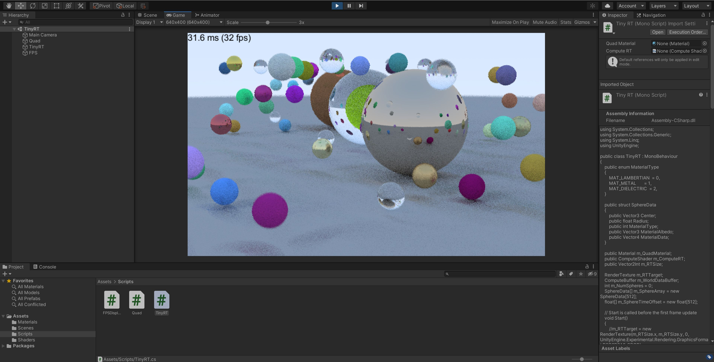

# Compute Tiny Ray Tracer

---

This is an Unity sample project which shows how to implement a tiny ray tracer using compue shader. The implementation is based on [Ray Tracing in One Weekend](https://raytracing.github.io/books/RayTracingInOneWeekend.html) artile. 
 