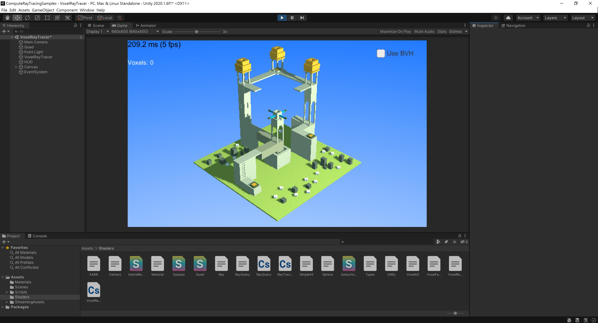

# Overview

This project collects multiple compute shader based ray tracing samples for Unity. Because the samples use compute shader for ray tracing, they are not as fast as hardware ray tracing. The main purpose of this project is demonstrating how the ray tracing works. It is very helpful for the people who want to know the knowledge behind hardware ray tracing. This project contains following samples:

- Ray Tracing in One Weekend
- Ray Query
- Hybrid Rendering
- Voxel Ray Tracer
- Subsurface Scattering (upcoming)
- Hybrid Ambient Occlusion (upcoming)
- Hybrid Reflection and Refraction (upcoming)

# Acknowledge
The voxel model in this project is created by [MagicaVoxel](https://ephtracy.github.io/index.html?page=mv_main).

# Samples

## Ray Tracing in One Weekend 

This sample demonstrates how to implement a basic ray tracer using compue shader. The implementation is based on

[Ray Tracing in One Weekend](https://raytracing.github.io/books/RayTracingInOneWeekend.html) article.

### Image Quality Compare

Samples per pixel  : 64

Maximum tracing depth : 64

Samples per pixel  : 16

Maximum tracing depth : 6

## Ray Query

This sample demonstrates how to implement ray query using compue shader. This sample uses simple ray tracing for shading and ray query for shadow.

## Hybrid Rendering

This sample demonstrates how to use ray query in fragment shader to render shadow. This sample uses traditional rasterizing for shading and ray query for shadow. That is why it is called hybrid rendering.

## Voxel Ray Tracer 
This sample demonstrates how to build a simple BVH tree and use it in compute shader to speed up scene traversal. This sample uses voxel scene to simplify the BVH building procedure.  

### With BVH

- 3 rays per fragment(1 ray for rendering, 2 rays for shadowing)
- 21129 voxels
- Use 15 levls deep BVH tree to speed up traversal
- ~200 fps

### Without BVH

- 3 rays per fragment(1 ray for rendering, 2 rays for shadowing)
- 21129 voxels
- Brute-force traversal
- ~5 fps

 
